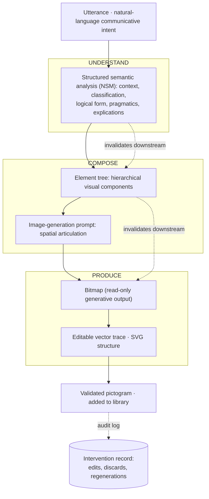

# Making Pictogram Construction Visible

**Designing Generative Tools for Professional AAC Practice**

This repository hosts the doctoral research proposal and Confirmation of Candidature presentation for **Herbert Spencer González**, PhD in Design at the **Auckland University of Technology (AUT)**, under the supervision of Dr Marcos Steagall and Dr Ivana Nakarada-Kordic, with Dr Welby Ings as advisor.

The research asks how generative image tools can be designed to make the construction of Augmentative and Alternative Communication (AAC) pictograms *inspectable* and *controllable* by the professionals responsible for validating them — speech-language therapists, special educators, and pictogram designers working with autistic transitional-age youth (16–26) navigating the passage to independent living. It develops a provotype, **[PICTOS.net](https://pictos.net)**, that stages the path from a natural-language phrase to a finished pictogram into discrete, editable steps, making visible the decisions that professionals currently navigate intuitively.

Working within a constructivist-interpretivist paradigm and Research through Design (Zimmerman et al., 2007), the inquiry proceeds through three overlapping cycles — IDENTIFY, EXPERIMENT, and VALIDATE & REFINE — combining semi-structured interviews with Chilean AAC professionals, participatory design sessions grounded in the Scandinavian tradition (Bødker et al., 2000; Ehn, 1988), and iterative prototyping. Verbal data are analysed with Reflexive Thematic Analysis; material data through Annotated Portfolios; the two are integrated through an activity-theory lens.

## Documents

1. **[Doctoral Research Proposal](making-pictogram-construction-visible.md)** — full research proposal text, with figures and references[^1].
2. **[Confirmation of Candidature presentation](https://herbertspencer.net/cc)** — the live reveal.js slide deck (source in [`index.html`](index.html)).

[^1]: The historical first version of the proposal — published under the working title *MediaFranca* — is preserved in the [`v1`](https://github.com/hspencer/cc/tree/v1) branch.

## Related repository

A shorter, more current Spanish-language companion lives at **[`hspencer/pictos-chile`](https://github.com/hspencer/pictos-chile)**, with the navigable version available at **<https://herbertspencer.net/pictos-chile>**. That document is the working summary in castellano; this repository remains the canonical English-language proposal and presentation.

----

### PICTOS.net pipeline

The provotype at the centre of the study, PICTOS.net, organises the path from utterance to pictogram across three professional control points — UNDERSTAND, COMPOSE, and PRODUCE. Each editable representation can be intervened on by the professional; edits at one step invalidate the steps downstream, which the tool marks as *outdated* until the professional regenerates them. All interventions are recorded by the audit log[^2].

[^2]: Library-level configuration — graphical preferences, geographic and cultural context, attribution — is transversal to the three control points. The audit log captures manual edits (prior and revised states) and discards (regenerated without editing), and travels with the library on export.

### Related project repositories

The doctoral artefact sits alongside the broader **[MediaFranca Initiative](https://github.com/mediafranca/)**, an open framework for inclusive, visual, and linguistically grounded communication systems that gathers earlier and parallel explorations of the same problem space.

1. [**Manifiesto**](https://github.com/mediafranca/manifesto) — ethical, social, and design principles guiding the MediaFranca ecosystem.
2. [**nlu-schema**](https://github.com/mediafranca/nlu-schema) — natural language understanding schema for decomposing utterances into semantic and pragmatic structures.
3. [**mf-svg-schema**](https://github.com/mediafranca/mf-svg-schema) — MediaFranca SVG Schema for AAC Pictograms.
4. [**ICAP**](https://github.com/mediafranca/ICAP) — *Pictographic Quality Index* (Índice de Calidad Pictográfica para la CAA) for measuring the communicative adequacy of generated pictograms.
5. [**pictos-chile**](https://github.com/hspencer/pictos-chile) — current, brief Spanish-language version of the proposal ([live](https://herbertspencer.net/pictos-chile)).

**Herbert Spencer González** · PhD in Design (AUT)  
[https://github.com/hspencer/cc](https://github.com/hspencer/cc) · [herbert.spencer@autuni.ac.nz](mailto:herbert.spencer@autuni.ac.nz)