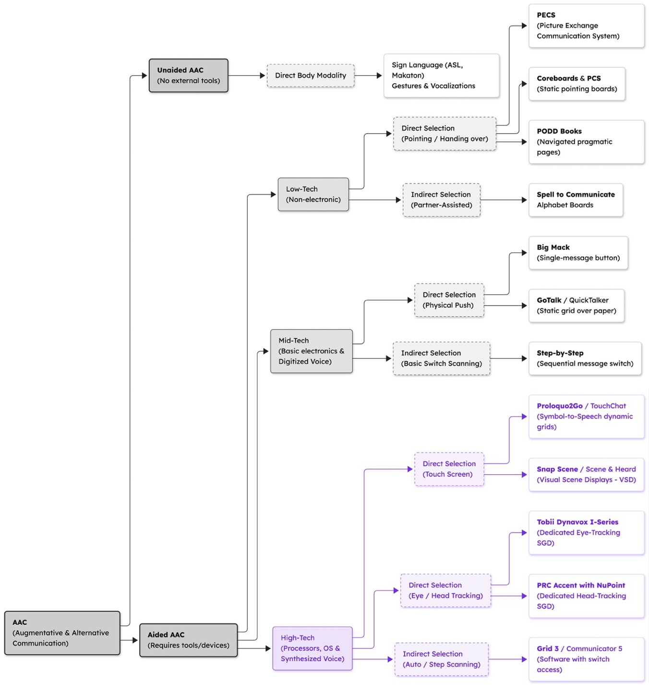
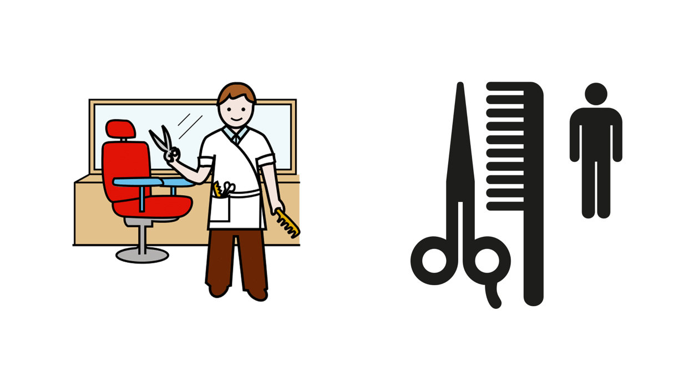
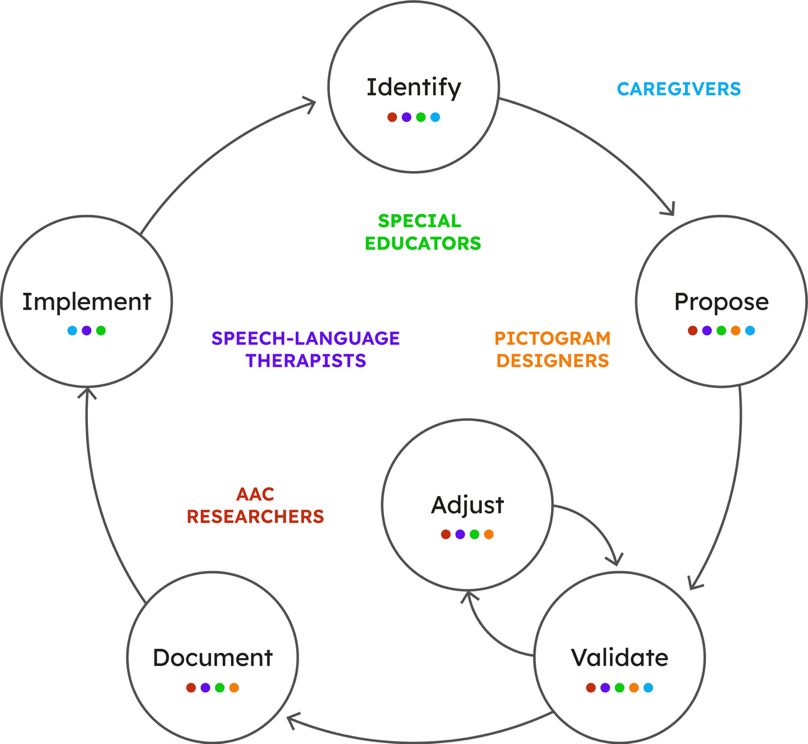
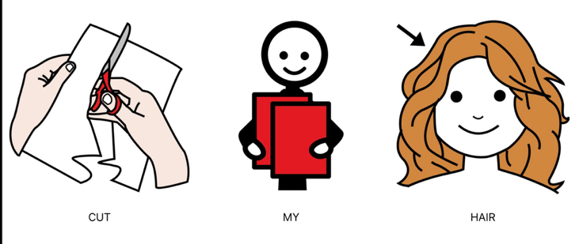
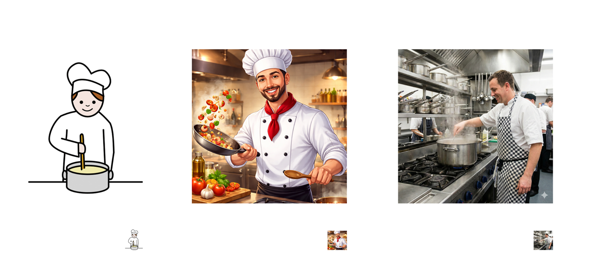
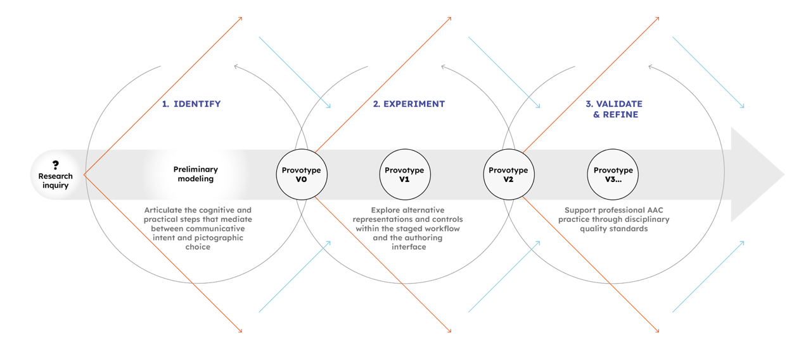

# Making Pictogram Construction Visible

## Designing Generative Tools for Professional AAC Practice

Doctoral Research Proposal — Confirmation of Candidature  
Herbert Spencer González · PhD in Design, Auckland University of Technology  
Supervisors: Dr Marcos Steagall, Dr Ivana Nakarada-Kordic · Advisor: Dr Welby Ings  
Date: 6 May 2026

## Summary

Augmentative and alternative communication (AAC) professionals — speech-language therapists, special educators, and pictogram designers — routinely create pictographic resources for people who communicate through visual tokens. When supporting autistic transitional-age youth (aged 16–26) in their passage to independent living, these professionals frequently need pictograms for personal, context-specific situations that existing pictographic libraries leave uncovered. Bryen (2008) found that standard symbol sets cover only about 55% of vocabulary needed for socially valued adult roles, and services drop sharply after high school — a pattern known as the “transition cliff” (Roux et al., 2015). Preliminary interviews with Chilean AAC professionals conducted for this study already document improvised workflows using consumer generative AI tools, confirming that the need is immediate and the gap is structural.

Generative AI image tools could help close these vocabulary gaps. Current systems treat image generation as a single-step, opaque process that gives professionals little ability to inspect or control the result. This project asks: how can generative image tools be designed to make the construction of AAC pictograms inspectable and controllable by the professionals responsible for validating them? Working within a constructivist-interpretivist paradigm and using research-through-design as the primary methodology, the research aims to develop a provotype (Boer & Donovan, 2012) that stages the path from a natural-language phrase to a finished pictogram into discrete, editable steps — making visible the decisions that professionals currently navigate intuitively. The provotype, PICTOS.net, is functional and publicly accessible, with its source code in a public repository.

The research proceeds through three overlapping cycles of inquiry — identification, experimentation, and validation — each advancing successive versions of the provotype. Participants are a purposive sample of Chilean professionals who work with AAC pictograms in practice. Data collection combines semi-structured interviews grounded in participants’ own casework, participatory design sessions where professionals critique and reshape the provotype, and iterative prototyping documented in a public repository. The analysis pairs Reflexive Thematic Analysis on verbal data with Annotated Portfolios on material artefacts, integrated through an activity theory lens. The project contributes to knowledge about how AAC pictogram authoring decisions can be made explicit and supported through tool design, offering a contextualised resource for an underserved Spanish-speaking context — with potential relevance for design research with generative AI materials more broadly.

## Research Question

Augmentative and alternative communication (AAC) refers to the strategies, tools, and systems that support communication when speech alone is insufficient. Across its forms — from printed pictogram boards to speech-generating devices — pictograms are among the most widely used resources: simplified graphic representations of words, concepts, actions, or instructions, organised into sets from which a communicator composes messages.

This research focuses on AAC pictogram work supporting autistic transitional-age youth, approximately 16 to 26, navigating the passage from childhood support systems toward independent adult life. Visual information often carries heightened salience in autistic cognition (Grandin, 2006; Mottron et al., 2006); the literal properties of a pictogram — what features are shown, how they are depicted, what is emphasised — shape whether it is readily recognisable or confusing. In AAC practice supporting this transition, pictograms are embedded in systems that structure selection and use across home routines, vocational preparation, and self-advocacy (Light et al., 2019). Their quality is a matter of communicative access. The study is situated in Chilean professional practice, where Spanish-language AAC work and locally appropriate materials for this transition remain underserved by the dominant pictographic libraries.

Creating and maintaining these systems is a shared professional responsibility. Speech-language therapists assess needs and prescribe vocabulary; special educators integrate pictographic materials into daily routines and independence skill-building; pictogram designers produce resources that balance iconic recognisability with stylistic consistency; and researchers contribute standards and evaluation frameworks. This thesis refers to them collectively as AAC professionals working in transition-to-independence contexts.

The research centres on this professional work — how AAC professionals make decisions about pictogram meaning, depiction, and adaptation when existing libraries fail to cover the specific, often situated vocabulary required for home-based routines, safety instructions, and self-directed activities (Figure 1).

<figure align="center" id="figure-1">
  
  <figcaption><b>Figure 1.</b> Categories of AAC systems and their selection methods. This research concentrates on high-tech, pictogram-based systems (highlighted in purple). Source: Author.</figcaption>
</figure>

AAC professionals rely on curated pictographic libraries — such as the open-access ARASAAC (Palao & Gobierno de Aragón, 2013) or the proprietary PCS Boardmaker set (Johnson & Watt, 1987) — which provide standardised, pre-validated resources. These libraries are limited: concepts are missing, pictograms are too generic, or cultural variants are unavailable. The pictograms required to support the transition to independent living are personal and context-specific, rarely found in generic sets (Yorkston et al., 1988), and keeping them current with a young person’s changing routines demands continuous adaptation that professionals handle without dedicated tools.

Generative image tools offer an opening. Given a text prompt, current models can produce images rapidly and at low cost, potentially closing vocabulary gaps that lie beyond the reach of manual production. However, the dominant prompt-and-select workflow provides limited control over communicatively relevant properties (level of abstraction, selection of depicted features, stylistic relation to an existing set, cultural specificity) and leaves only weak traces of decisions made: the reasoning behind rejections, considered alternatives, and revisions stays outside the record. This is at odds with how AAC pictogram production works in practice — a cycle of proposing, reviewing, correcting, and re-validating, in which decisions must be justifiable and retrievable because pictograms are reused, taught, and adapted across contexts, and professionals remain accountable for the materials they produce (Draffan et al., 2023; Zastudil et al., 2024). Tools that integrate generative AI into this cycle with the transparency and control it requires remain undeveloped. The gap lies on the design side; generative capability is sufficient.

This project frames that gap as an interaction design problem, asking:

*How can generative image tools be designed to make the construction of AAC pictograms inspectable and controllable by the professionals responsible for validating them?*

Addressing this question begins from the day-to-day work of AAC professionals who interpret communicative intent and translate it into pictographic choices. It asks what criteria guide those decisions, how they shift across individuals and situations, and which on-screen representations help professionals locate problems, make targeted revisions, and reuse solutions. At its core: what are the right control points? Between a phrase in natural language and a pictographic image lies a space of decisions that professionals navigate by instinct. Which of those decisions can be surfaced, adjusted, and recorded? That uncertainty lies beyond pure analysis; it requires a functional artefact professionals can use, critique, and reshape.

The project develops a proof of concept for a pictogram authoring interface, built iteratively throughout the study. The system functions as a *provotype*: a deliberately incomplete working artefact designed to make professional judgement visible and to evolve through the questions it raises in use.

This doctoral research pursues four objectives:

1. To document the decision criteria that AAC professionals use when accepting, rejecting, or revising pictograms;
2. To iteratively design and develop a provotype that exposes those decisions as inspectable and controllable steps;
3. To evaluate through participatory design sessions whether the system’s controls enable AAC professionals to locate and repair problems in generated pictograms;
4. To document the design decisions and their rationales as a methodological contribution to Research through Design with generative AI.

## Rationale and Significance

### Rationale

The case for this project rests on four converging arguments.

First, this research develops knowledge absent in an integrated form. Research on generative support for AAC has grown across distinct strands — retrieval-based pictographic mapping, neural prediction, text-to-image generation, multimodal scene authoring. Each advances technical possibilities. What remains underdeveloped is an integrated account of how those possibilities can be incorporated into professional pictogram work while preserving the cycles of proposing, reviewing, correcting, and re-validating that define responsible AAC practice (Draffan et al., 2023). This project contributes the specific design knowledge of that workflow: its interaction logic, its representations, and its documentation structures.

Second, this research intervenes at a formative moment. Interviews with Chilean AAC professionals already document workflows organised around generative image tools — improvised pipelines assembled from consumer systems such as ChatGPT or Midjourney — adopted not because purpose-built alternatives exist but because vocabulary gaps are immediate and the tools at hand. Once adopted, such practices tend to persist; contributing design knowledge while approaches are still forming has more leverage than intervening after the fact.

Third, this research belongs to a discipline uniquely equipped to address it. Between communicative intent and pictographic representation lies an unmapped space of decisions: what to show, what to omit, how abstract to be, how to balance recognisability with visual economy. That space lies beyond pure specification; it requires exploration and judgement. Professionals enact this intuitively. Design research clarifies the process without dictating it, enabling professional judgment to be exercised, observed, and improved. This work belongs in Design because it centres on the creative act through which abstract communicative needs take visual form.

<figure align="center" id="figure-2">
  
  <figcaption><b>Figure 2.</b> Left: ARASAAC pictogram “Peluquería” (Sergio Palao / Government of Aragon, CC BY-NC-SA 4.0). Right: AIGA/DOT public information pictogram for Hairdresser Services (American Institute of Graphic Arts [AIGA], 1974/2017, public domain). The ARASAAC pictogram uses a narrative scene with contextual detail and a childlike figure; the AIGA/DOT system reduces the concept to essential objects and a neutral adult form. For adolescents transitioning to independent living, this difference has direct implications for dignity, appropriateness, and willingness to use the communication system (Zisk & Dalton, 2019).</figcaption>
</figure>

Fourth, this research draws on a disciplinary tradition that has not yet been applied to the AAC pictogram problem. The dominant pictogram libraries did not emerge from information design but from clinical and educational contexts where functional adequacy took precedence over visual quality, systemic coherence, or age-appropriateness. The result is an aesthetic calibrated for young children, applied without adjustment to adolescents and adults. For a young autistic individual navigating the transition to independent living, communication materials that appear childlike carry a cost to dignity, identity, and willingness to use the system (Batorowicz et al., 2025). Information design has long addressed problems of legibility, age-appropriateness, and systemic consistency at scale; this project brings that inheritance into AAC professional practice (Figure 2).

### Significance

This project offers four forms of contribution.

The first contribution makes explicit what currently exists only as tacit professional practice: how AAC professionals interpret communicative intent through pictographic choices, the criteria guiding their judgements about meaning and visual form, and how they handle revision and reuse with autistic transitional-age youth across different independent-living contexts. This reasoning has no shared vocabulary — exercised daily but rarely articulated. The project documents this through sustained engagement with practitioners: their accounts of decision-making, the breakdowns and workarounds surfaced in participatory design sessions, and the criteria they apply when evaluating generated output. The result is an account of professional pictogram authorship that the field lacks.

The second contribution is grounded in context. AAC research and the dominant pictographic libraries have been developed overwhelmingly in English-language, European, and North American settings. This project generates design knowledge from Chilean professional practice, working in Spanish with a population whose communicative and cultural needs remain absent from the international literature. Chile presents specific conditions: a culturally diverse population (over one in ten Chileans identifying as indigenous, reaching one third in some regions; *Instituto Nacional de Estadísticas* [INE], 2025), and a public discourse around autism that has historically framed autistic people as subjects of care, with their status as rights-bearing agents with adult communicative needs underacknowledged (Zañartu & Castillo, 2025). Ley 21.545 (Gobierno de Chile, 2023) recognises adults with autism as rights-holders across education, health, and social participation, yet leaves the transition to independent living practically unaddressed. AAC pictogram materials that are age-appropriate, locally situated, and produced with professional accountability carry direct implications for the dignity and self-determination of this population, with relevance for Spanish-language AAC practice and design work in culturally diverse settings more broadly.

The third contribution is methodological: how to work with generative AI not as a tool that follows instructions but as a material with properties, resistances, and affordances learned through making (Redström, 2017). In AAC, this carries ethical weight, since these pictograms directly affect communication for people with complex needs, raising the demands for professional oversight, transparency, and accountability. How those demands are addressed through design decisions (what is exposed, what can be adjusted, what remains fixed) is a question the project engages through making. The contribution is a documented case in which the material resisted, and the constraints had to be built in to keep professional judgement at the centre of a computationally augmented workflow.

Where the first contribution is empirical — documenting what professionals know and do — this fourth contribution is disciplinary: what design, as a mode of inquiry, uniquely contributes. AAC pictogram authoring is a problem of form-giving: the form emerges through making, in advance of any formal specification, through construction, observation of where it succeeds or fails to communicate, and adjustment (Schlosser & Sigafoos, 2002). Design provides the methods for this: exploration, testing, and the exercise of judgment within constraints. By bringing the epistemology and practice of interaction design, the project contributes to a design research tradition within the AAC pictogram field, one that foregrounds professional authorship, visual quality, and cultural adequacy alongside functional correctness.

## Contextual Review

This review sets the context for the research question through four complementary perspectives. Part 1 examines the design tradition for pictograms and the quality criteria established by AAC research. Part 2 addresses professional AAC practice and where current tools fall short in supporting that knowledge. Part 3 surveys generative approaches to AAC pictogram production. Part 4 examines how AI-assisted image platforms expose or obscure their decision logic. Together, the four parts establish the gap this research addresses: an absence of design that makes generative capability inspectable and accountable to professional judgement.

### Part 1: What makes a good AAC pictogram?

Pictogram design has roots in early twentieth-century information design. Otto Neurath’s ISOTYPE established principles that still inform the field: controlled abstraction, internal set consistency, and instruction-free legibility (Neurath, 1936). Otl Aicher extended these to cross-cultural legibility under real-world conditions (Aicher et al., 1991), and Paul Mijksenaar formalised information design as the arrangement of visual signs to make something understandable (Mijksenaar, 1997).

This tradition contributed to international standards for pictogram quality. ISO 9186-1 establishes methods for testing whether graphical symbols can be understood without text (ISO, 2014); ISO 22727 grounds requirements in template consistency, line-weight discipline, and economy of features (ISO, 2007); ISO 7001 specifies registered public information symbols for wayfinding (ISO, 2023). However, this lineage positions pictogram quality primarily for public signage. In AAC, context decides quality: a pictogram’s effectiveness depends on who uses it, for what purposes, in which settings, and within which relationships. Pictograms are tools for acting on the world — expressing wants, making requests, refusing offers, directing others — learned and practised in the places where people live, study, work, and interact.

The AAC research literature has developed several constructs for pictogram quality. Correspondence refers to the relation between a pictogram and the referent subsequently identified by the user (Schlosser & Sigafoos, 2002); iconic transparency measures how easily a person can guess a pictogram’s meaning without prior instruction; perceptual similarity describes how closely visible features match the concept represented (Fuller & Lloyd, 1991); and economy of depiction names the deliberate reduction of detail to aid recognition. These constructs map only loosely onto the ISOTYPE and information design tradition, while addressing related problems — how to make a visual sign readable, learnable, and consistent — and the two bodies of work have rarely been brought into dialogue.

This dialogue matters for age-appropriateness. The major AAC pictogram libraries — including ARASAAC and PCS (Boardmaker) — were developed primarily for children. Their visual register reflects this: stick human figures, simple outlines, and a representational style calibrated to early childhood. For autistic transitional-age youth moving towards independent living, childish-looking communication materials can undermine the dignity and self-determination of the people who use them. Zastudil et al. (2025) note a homogenisation effect in AI-assisted AAC authoring, where generative tools tend to reproduce existing visual conventions. Information design offers principles for addressing this — Aicher demonstrates that abstraction can communicate purposeful action — yet their systematic application to AAC pictogram design for adult users remains undeveloped.

How pictograms are interpreted by autistic people adds further complexity. Hartley and Allen (2015) describe a tendency toward literal mapping in which interpretation depends primarily on a pictogram’s visible properties, with socially negotiated conventions playing a smaller role. A small change in visual detail can be the difference between a recognisable pictogram and a confusing one. Research on visual processing in autism documents differences in visual search performance relevant to pictogram organisation (O’Neill et al., 2019; Wilkinson & Madel, 2019), advantages of colour photographs over cartoons for object retention (Carter & Hartley, 2020), benefits of animation for action verb comprehension (Schlosser et al., 2019), and stronger iconicity effects when meanings are harder to infer (Vélez-Coto et al., 2017). The shared conclusion is cautious: what counts as accessible depends on the kind of meaning, the form of representation, and the conditions of use.

This becomes more complex when pictograms must represent abstract concepts. Concrete objects can be depicted through recognisable visual properties, but many routine communication needs involve abstract meanings: negation, plurality, possession, temporal relations and emotional states. AAC systems address this through visual blends (Paivio, 2013) — culturally located metaphors using conventional graphic devices, such as ARASAAC’s ’+’ for plurality and diagonal line for negation. The tension is conceptual: visual blends depend on socially negotiated convention — a kind of relation that literal mapping struggles to support. For generative pictogram systems, this creates a design requirement: abstract concepts must be encoded through stable, learnable conventions that remain consistent across all generated pictograms. The question concerns how to make those conventions transparent and systematic — a requirement this project addresses by making the construction logic inspectable.

### Part 2: Professional AAC work and its structural limitations

AAC pictogram work depends on a network of professionals — speech-language therapists, special education teachers, and pictogram designers — who select, adapt, and validate pictograms in collaboration with families and caregivers. Families hold situated knowledge that lies outside professional reach: what routines actually look like, which vocabulary gaps emerge during real interactions, and how pictograms need to adapt as circumstances shift. Both work within institutional constraints, including time, resources, and the need to coordinate across home, school, and community. The pictograms produced are maintained, taught, and revised as life circumstances change (Beukelman & Light, 2020; Figure 3).

A core distinction is between core vocabulary (high-frequency words like want, help, stop covered by standard libraries) and fringe vocabulary (situation-specific items tied to a person’s particular routines, places, tools, and relationships). No library can anticipate fringe vocabularies. Bryen (2008) found that across three widely used symbol sets, only approximately 55% of vocabulary identified as necessary for socially valued adult roles was available — the gap is structural in character (Light et al., 2019). When professionals encounter a missing pictogram, they resort to workarounds — combining existing pictograms, accepting near-matches, or commissioning custom drawings — solutions that alter meaning, increase effort, and undermine visual consistency (Finak et al., 2024).

The dominant open Spanish-language pictogram resource is ARASAAC (Palao & Gobierno de Aragón, 2013), with over 12,000 pictograms. ARASAAC is freely available — a practical advantage in resource-constrained public education — but distributed under Creative Commons Attribution-NonCommercial-ShareAlike, which prohibits commercial use and constrains integration into commercially distributed platforms. Proprietary resources such as PCS (Boardmaker) offer consistent visual conventions but limit modification and require a paid subscription. Neither addresses the long tail: the situated vocabulary that emerges from real use — a pictogram for my aunt’s blue front door, or the specific bus route to the community centre — and requires creation on demand (Paolieri & Marful, 2018).

The transition to independent living for autistic adolescents sharpens these limitations. The Drexel National Autism Indicators Report (Roux et al., 2015) found approximately 26% of young adults on the autism spectrum received no services after high school — the transition cliff, where communicative demands increase precisely as institutional supports decline. Household tasks, vocational participation, public services, and self-advocacy each require pictograms that are specific, locally relevant, and routinely absent from standard libraries. Yu et al. (2024) describe just-in-time programming as the professional response: rapid preparation of communication materials in direct response to emerging needs. Timeliness matters because vocabulary needs arise in the moment, while speed intensifies the demands on professional judgement.

<figure align="center" id="figure-3">
  
  <figcaption><b>Figure 3.</b> The pictogram authoring lifecycle as a shared professional workflow. Six stages form a recurring, non-linear cycle; the loop between adjust and validate reflects iterative revision before documentation and implementation. Dot colours indicate which professionals participate at each stage; responsibilities overlap across the cycle. Caregivers are positioned as the persistent context within which communicative needs arise. Adapted from Beukelman and Light (2020).</figcaption>
</figure>

Documentation is a further dimension often underestimated. Pictogram production is a cycle of proposing, checking, revising, and validating under time and accountability constraints. Professionals need to explain why a particular pictogram exists, when it should be used, and how it differs from related pictograms — knowledge shared across caregivers, taught to family members, and reused across contexts. A pictogram lacking documented rationale is harder to maintain and easier to misapply (Tönsing et al., 2023). The practical infrastructure for this documentation is absent from current professional workflows — a gap this project positions as a design problem.

### Part 3: Generative approaches to AAC pictograms

Interest in generative support for AAC has grown in response to the practical problem described in Part 2: the vocabulary required for everyday participation changes faster than fixed pictographic libraries can accommodate (Paola et al., 2024; Yang et al., 2025). Generative AAC refers to computational methods that produce pictograms, sequences, or variants from text, images, or existing pictograms. This section reviews three families of approaches.

A first family treats generation as retrieval and recombination: systems that receive a word or phrase and return pictograms from an existing library, assembled into sequenced strips (Figure 4). This preserves established visual conventions — important when materials must be consistent with what a person has already learned (Cabello et al., 2018; Schwab et al., 2020). Its limitation is structural: the system can produce only what the library already contains.

<figure align="center" id="figure-4">
  
  <figcaption><b>Figure 4.</b> Example of a retrieval-based output: three ARASAAC pictograms assembled from library to represent “Cut my hair” (DictaPicto App, Fundación Orange, Spain). The sequential assembly mirrors written syntax, treating pictograms as lexical substitutes within a visual sentence.</figcaption>
</figure>

A second family, predictive sequencing, addresses message composition speed; vocabulary gaps remain unaddressed by this family. Systems such as PictoBERT and PrAACT use neural models to anticipate which pictogram is likely next in a sequence, functioning as autocomplete for pictogram-based communication (Pereira et al., 2022, 2024). Like retrieval, predictive sequencing operates within existing libraries.

A third family moves beyond existing libraries: generative models that produce pictograms from text descriptions, or transform existing pictograms into stylistic, detail, or contextual variants. This is the family most relevant to the present project. The most relevant published work is Draffan et al.’s (2023) pilot, which explored AI-supported adaptations of pictograms in the style of existing sets. The study documented possibilities and limits: stylistically similar variants for concrete objects, struggles with complex or abstract concepts, and required professional revision to meet AAC quality criteria. Since that pilot, the technical baseline has shifted substantially. Recent multimodal systems support higher-fidelity image generation and stronger visual consistency when reference images are provided. However, no commercial tool applies generative image models specifically to AAC pictogram production with the professional controls clinical practice requires.

The advance in general-purpose generation sharpens AAC-specific constraints. The primary design question is whether generation can maintain a stable visual style across dozens or hundreds of pictograms so they remain coherent for search, learning, and reuse. Adding visual detail or photographic realism — which generative models do well — can introduce ambiguity or cultural mismatch, where simplicity at small display sizes is a functional requirement (Figure 5).

<figure align="center" id="figure-5">
  
  <figcaption><b>Figure 5.</b> Three visualisations of the concept cook: left, ARASAAC pictogram Cook (Sergio Palao / Government of Aragón, CC BY-NC-SA), simplified for small-scale legibility; centre, a stylised image from Sora (OpenAI); right, a photorealistic image from Gemini (Google). At thumbnail scale, the ARASAAC pictogram remains more legible than the two generative outputs.</figcaption>
</figure>

A further gap affects all families: current generative workflows operate through prompting — the user describes what they want, the model produces an output, and the user accepts or rejects it. This offers limited control over communicatively relevant properties and leaves weak traces of professional reasoning. Across the three families, a recurring concern is that generative assistance can produce fluent, plausible outputs of unchanged communication quality. Zastudil et al. (2025) found that AI assistance increased AAC professionals’ confidence while the quality of resulting communication boards remained unchanged — perceived helpfulness diverged from observable quality. Generative tools that reinforce existing visual conventions leave the age-appropriateness problem of Part 1 untouched.

### Part 4: Platform design for professional pictogram authoring

The previous sections describe what professionals need from pictograms and what generative methods can produce. This section concerns the platform through which professional authoring takes place.

Current AAC platforms are designed primarily for assembling and distributing communication displays — selecting pictograms from a library, arranging them in grids or scenes, and outputting printable or digital boards. They support display construction at a given moment but provide limited support for two activities professionals describe as central to ongoing work: documenting why a pictogram was chosen over alternatives, and revisiting those decisions when routines, settings, or goals change. Documentation capabilities for professional AAC workflows remain underdeveloped across systems reviewed in the literature, even as the number of contributors to a person’s vocabulary — therapists, educators, caregivers, family members — makes shared rationale increasingly important (Guasch et al., 2022; Tönsing et al., 2024a; Tönsing et al., 2024b; Vella et al., 2022).

This gap becomes more consequential when generative features are introduced. A system that proposes pictographic content changes the professional’s task: the question is no longer only which pictogram should I choose? but should I accept what the system proposes, and on what basis? Human–AI interaction research has established that people treat system suggestions as open to revision only when the interface actively supports inspection, modification, and error recovery (Amershi et al., 2019). When these supports are absent, the default is acceptance — a pattern that, as discussed in Part 3, can increase confidence without improving quality (Zastudil et al., 2025).

A more fundamental issue concerns what the professional can see and do during generation. In most current generative workflows, the output is presented as a finished artefact: the professional receives a completed image and decides whether to accept or reject. The reasoning that produced it — what the system interpreted as communicative intent, which visual features it selected, why it composed the image as it did — remains hidden.

Recent HCI work has begun to address this. DirectGPT (Masson et al., 2024) applies direct manipulation principles to generative outputs: users select, edit, and localise instruction effects on the artefact, reducing task completion time by around half. PromptCharm (Wang et al., 2024) visualises how prompt terms influence image regions, allowing weight adjustment and version control across iterations. These systems demonstrate that exposing intermediate states and enabling direct intervention during generation are technically feasible and yield measurable improvements in user control. Neither has been applied to AAC pictogram authoring — a domain where each visual decision carries communicative weight, and where the criteria for ‘good enough’ are set by professional judgement about a specific person’s needs.

This design problem — keeping professional authorship at the centre of a computationally augmented process — has been formalised through the concept of AI as design material. Liao et al. (2023) describe a designerly understanding of AI: practical knowledge that supports informed decisions about model behaviour and when to intervene. For AAC, this maps onto interpreting communicative intent, deciding visual form, evaluating against person-specific criteria, and documenting reasoning for review and reuse. A platform that presents generative output as a finished image leaves this work invisible.

No existing AAC platform integrates the three capabilities this analysis identifies as necessary: controlled, step-by-step generation that exposes intermediate decisions; editing operations that allow professionals to intervene at specific points in the construction process; and traceable documentation that records what was decided, what was changed, and why. The present project addresses this integrated gap as a design research problem.

None of the four bodies of work reviewed here — pictogram quality, professional workflows, generative approaches, or platform design — provides an integrated account of how professional reasoning can be made visible and revisable throughout the generation process. Standards establish what quality looks like, but not how it is negotiated in practice. Workflow studies document what practitioners do but lack tools to support it. Generative systems increase speed but remove the decision structure that makes quality controllable. Authoring platforms allow editing while concealing the intermediate representations that shape construction from phrase to image. This project addresses that compound gap: an auditable workflow in which each step can be inspected, adjusted, and regenerated — keeping the professional as the author of every validated output.

## Design of the Study

### Paradigm and methodology

The study is conducted within a Research through Design paradigm (Zimmerman et al., 2007), in which the iterative production of an artefact is a primary mode of inquiry, and within the Scandinavian tradition of participatory design (Bødker et al., 2000; Ehn, 1988), in which the participation of professional users in shaping their tools is methodologically and politically constitutive. The methodology is practice-based, in the sense developed by Candy (2006) and elaborated by Candy and Edmonds (2018): the working artefact (PICTOS.net, here functioning as a provotype) and the exegetic record around it together constitute the research output, alongside the conventional textual argument.

The choice of paradigm and methodology is grounded in the object of study. PICTOS.net is a generative tool whose design decisions are under investigation; understanding how those decisions function and how they should change requires sustained engagement with the tool by its users, in iterative cycles of articulation, intervention, and reflection. Practice-based research and Scandinavian participatory design together support this work: the artefact is the site of inquiry, and professional users carry it forward.

The researcher operates as an instrument of the analysis. This is consistent with the epistemological commitments of Reflexive Thematic Analysis (Braun & Clarke, 2021) and of practice-based research more broadly, where the researcher's situated judgement is part of the analytic apparatus and declared as such.

### Architecture of the inquiry

The inquiry is structured around three overlapping iterative cycles depicted in Figure 6: IDENTIFY, EXPERIMENT, and VALIDATE & REFINE. The cycles draw on Banathy’s (1996) dynamics of divergence and convergence: divergent moments open possibilities, convergent moments narrow options and consolidate decisions, and the rhythm operates both within a single iteration and across the series. The cycles overlap, and successive iterations work them in different proportions.

The IDENTIFY cycle, completed between May 2025 and February 2026 under AUTEC application 25/44, comprised semi-structured interviews with eight AAC professionals, supplemented by two preliminary conversations conducted before ethics approval and treated as contextual background. This cycle characterised current professional practice by modelling the cognitive and practical steps that mediate communicative intent and pictographic choice, and produced a thematic codebook that organised 54 concepts into five themes (presented below).

The EXPERIMENT cycle is already underway through the iterative development of the provotype itself. The provotype versions (Figure 6) represent successive refinements to the technical artefact and to the methodological framework around it that have been carried out by the researcher since the close of the IDENTIFY cycle. The participatory design sessions of the second phase, planned and pending an amendment to AUTEC 25/44, formalise the EXPERIMENT cycle as collective work with professional participants and open the transition into the VALIDATE & REFINE cycle. Early sessions explore alternative representations and controls within the authoring interface; later sessions converge toward refinement against the multidisciplinary quality standards of professional AAC practice, with the provotype advancing toward v(n) across the series. This second phase positions the same community of professionals as co-authors of the tools their practice requires and produces material artefacts (libraries of pictograms with their accompanying audit records) that constitute the corpus for an AP analysis.

<figure align="center" id="figure-6">
  
  <figcaption><b>Figure 6.</b> The RtD methodology is structured into three overlapping iterative cycles , with the provotype advancing through successive versions. Divergent arrows (orange) mark phases of exploration where possibilities are opened; convergent arrows (blue) mark phases where options are narrowed and decisions consolidated — a rhythm of opening and closing drawn from Banathy’s dynamics of divergence and convergence (Banathy, 1996).</figcaption>
</figure>

### The provotype: PICTOS.net

The artefact at the centre of this study is a provotype, in the sense developed by Boer and Donovan (2012): a working artefact designed to provoke critical engagement with a problem space, opening assumptions and tensions for examination. PICTOS.net is a publicly available, working pictogram-generation tool that operationalises a generative pipeline grounded in Natural Semantic Metalanguage (NSM; Goddard & Wierzbicka, 2014) and exposes its intermediate representations for professional editing. Its role in the study is to draw out professional judgement about how pictogram construction should work. PICTOS.net evolves throughout the study; each artefact entering the analytic corpus is tagged with the system version that produced it.

The professional’s interaction with the system is organised across three control points named after the corresponding professional acts: UNDERSTAND, COMPOSE, and PRODUCE. The utterance — the natural-language expression of the professional’s communicative intent (for example, *I’m hungry*, *I want chicken*, or *Did I do it right? I’m not sure*) — is the input to the pipeline. UNDERSTAND exposes the structured semantic analysis of the utterance in Natural Semantic Metalanguage format, with editable fields covering aspects such as context, classification, logical form, pragmatics, and NSM explications. COMPOSE exposes the element tree (a hierarchy of visual components composing the pictogram, with a fixed root and child nodes for the substantives and concepts depicted) and the image-generation prompt (the textual articulation of their spatial disposition). PRODUCE renders a bitmap as read-only output of the generative model, then derives an editable vector trace and SVG structure where the professional refines the final pictogram. Library-level configuration — graphical preferences, geographic and cultural context, attribution — is transversal to the three control points.

The pipeline implements a cascade of invalidation: an edit at one phase invalidates the downstream phases, which the tool marks as *outdated* until the professional explicitly regenerates them. The cascading behaviour is part of the methodological frame: it makes visible how interventions propagate through a chain of representational decisions, and it lets professionals articulate where in the pipeline they would prefer to intervene for a given communicative outcome.

PICTOS.net incorporates an audit logging functionality that records professional interventions across the editable representations within the three control points. Two kinds of intervention are recorded: manual edits, which capture the prior and revised states of the modified content, and discards, which capture content the professional regenerates without editing. Events are captured at commit moments — when the professional confirms a change — so that the record reflects deliberate decisions in the workflow. Each pictogram in a library carries an associated record of its work sessions and intervention events. Authorship is attributed at the library level through the library’s authorship metadata; intervention records carry no personal identifier. Logging is enabled by default, with a global toggle accessible to the participant, and per-pictogram inspection, edit, and deletion capabilities are always available. The intervention record travels with the library on export by construction, and enters the analytic corpus only when a participant chooses to share the library. This implementation makes professional interventions on the generative pipeline documentable by the tool itself, under participant control.

### Phase 1: Completed interview phase

Eight professionals participated as formal research participants across seven recorded interviews conducted in Santiago, Valparaíso and Quilpué between May 2025 and February 2026. Two additional preliminary conversations preceded ethics approval and informed the design of the interview instrument; these are treated as contextual background and remain outside the analytic corpus. The participant profile appears in Table 1.

<figure align="center" id="table-1">
  <table>
    <thead><tr><th>Code</th><th>Anonymised Profile</th><th>Area of Expertise</th><th>Setting</th><th>Years of experience</th></tr></thead>
    <tbody>
      <tr><td>D1</td><td>ARASAAC Designer</td><td>Design</td><td>AAC Library development</td><td>19</td></tr>
      <tr><td>T1</td><td>Researcher, SLT, AAC Coach (Core boards)</td><td>Special Education</td><td>Specialist AAC Service</td><td>22</td></tr>
      <tr><td>T2</td><td>Researcher in pictogram validation, Speech-Language Therapist</td><td>Psychology / SLT</td><td>Academic research</td><td>4</td></tr>
      <tr><td>T3</td><td>AAC Researcher, SLT, parent of a child with CCN</td><td>Psychology / SLT</td><td>Academic research</td><td>12</td></tr>
      <tr><td>D2</td><td>Information Design researcher</td><td>Design</td><td>Academic research / Pictogram system design</td><td>31</td></tr>
      <tr><td>T4 & T5</td><td>Special Educators</td><td>Special Education / SLT</td><td>Specialist education NGO</td><td>13, 8</td></tr>
      <tr><td>T6</td><td>School Principal</td><td>Special Education</td><td>Specialist education NGO</td><td>27</td></tr>
      <tr><td>T7</td><td>Speech-Language Therapist</td><td>SLT</td><td>University / clinical practice</td><td>21</td></tr>
      <tr><td>T8</td><td>Centre Director</td><td>Special Education</td><td>Public specialist</td><td>25</td></tr>
    </tbody>
  </table>
  <figcaption><b>Table 1.</b> Participant profiles. SLT = Speech-Language Therapist. D1 and T1 took part in preliminary conversations prior to AUTEC approval (25/44, April 2025); these are contextual background and lie outside the analytic corpus. Formal interviews with both are planned in a subsequent phase, within the ethics pathway scope.</figcaption>
</figure>

Interviews followed a semi-structured guide articulated across six thematic tracks: personal experience with AAC; systems in use; implementation and adaptations made; barriers to adoption and use; a life-cycle perspective; and speculation about future possibilities. The structure provided sufficient consistency across sessions to support comparative analysis while leaving space for participant-led elaboration. The final track, oriented toward speculation about possible futures, opens the prospective dimension that the participatory design sessions of Phase 2 sustain and concretise with the provotype as material.

Interviews were conducted in Spanish, the working language of all participants and the researcher. Each interview lasted approximately one hour. Audio-only recordings were transcribed automatically and then reviewed by the researcher for accuracy. Coding and theme construction were carried out in English, the language of the doctoral programme, with reflexive attention to the translation between Spanish source and English analytic categories at every step.

Five themes were identified; their full descriptions and the chain from interview findings to the architecture of the provotype are presented in the Progress and Activity to Date section.

These themes inform the design of Phase 2 by identifying the operational concerns the participatory design sessions are oriented to surface in greater specificity: the gradient of abstraction, the situated work of adaptation, the asymmetries around authorship, and the prospective horizon of generative tools.

### Phase 2: Planned participatory design sessions

This phase positions AAC professionals as co-authors of the tools their practice requires, consistent with the Scandinavian tradition of participatory design (PD; Bødker et al., 2000; Ehn, 1988). The principle the project enacts is that those who do the work with a tool have a constitutive role in shaping the tool itself: AAC professionals (speech-language therapists, special educators, pictogram designers, AAC researchers) are the workers of pictogram authoring and therefore the appropriate participants in the design of the authoring tool. End users of the pictograms are autistic individuals (frequently children) whose engagement with pictogram-construction tools is mediated by these professionals, who select, adapt, validate, and produce pictograms for and with them; the direct participation of end users in the design of the authoring tool itself is identified as belonging to a future phase beyond the scope of this thesis.

The study investigates the design of the tool for professional operators; the participation of autistic users in the design of specific pictograms is mediated by the clinical, pedagogical, and aesthetic expertise of the professionals who attend to them directly, given the practical reality that genuine direct access to autistic users is constrained at this stage of the inquiry. A future phase of the research could include autistic users directly; the present phase is limited to professional users of the tool.

Sessions are discursive in character: participants articulate their professional reasoning, proposals for system change, and evaluations of generated artefacts. The provotype operates through what Nielsen (2023) terms intent-based outcome specification: the user declares, in natural language, what is desired, and the system resolves the intermediate steps. Recent literature documents the broader paradigm (Subramonyam et al., 2025; Zhang et al., 2024; Vaithilingam et al., 2024). Because the tool operates through verbal specification of intent, the sessions in which professionals engage with it follow the same logic, centring participants’ professional authority in the medium where it is most effective.

Five sessions are scheduled, involving up to ten unique professionals from the registered users of PICTOS.net who have applied the tool in real work situations. Sessions vary in format, from individual to small-group (up to four participants), and from in-person (in Santiago, Valparaíso, Quilpué, and other institutional sites) to online via videoconference. A common protocol structures all sessions, regardless of format, with format-specific adaptations explicitly declared. Each session lasts approximately one hour, with a tolerance of plus or minus twenty minutes. Sessions are conducted as one-off engagements, and the locus of longitudinal engagement is participants’ ongoing professional practice with the tool, supported by an open channel for asynchronous contributions to the repository. Recruitment is from three converging channels: the pool of registered users of PICTOS.net who have used the tool in real professional contexts; snowball recruitment through existing participants; and direct approach to specialist centres in AAC, autism transition to adult and independent living, vocational training, and AAC research, primarily in Chile.

Sessions are facilitated by the researcher alone, who guides the conversation, mediates verbal articulation, and operates the provotype where the format calls for it. In group in-person sessions, the researcher operates PICTOS.net on a shared central screen; in online sessions, each participant operates PICTOS.net on their own device while the researcher moderates. Verbal-to-visual translation happens entirely within the provotype itself. The working case for each session is generated in situ from material already accessible in PICTOS.net or from cases brought by participants from their practice.

The session is organised into five moments. An opening of approximately five minutes welcomes participants, restates the session’s purpose, confirms informed consent and audio recording, and checks the audit logging status (which the participant controls). If the session is online and a participant has used PICTOS.net recently, a brief orientation to the current interface state follows; otherwise, no training is needed, as participants are recruited from active users.

Moment 1,  Narrative , lasts approximately fifteen minutes. Each participant in turn shares stories from their professional practice with PICTOS.net: what they have tried, what has worked, what has failed, what they have had to improvise. The opening prompt invites the recounting of specific recent episodes where the tool’s use produced unexpected outcomes, whether successful, frustrating, or instructive. The prompt invokes the elicitation logic of the Critical Incident Technique (Flanagan, 1954; Castillo et al., 1998) to anchor the conversation in concrete situated experience; the transcripts of these narratives feed the analytic procedures described below. In multi-participant sessions, each participant has approximately three to four minutes; in individual sessions, the participant has the full duration. This phase anchors the session in participants’ existing relationship with the provotype and surfaces the situated material that subsequent phases work with.

Moment 2,  Speculative , lasts approximately twenty minutes. The discussion is structured by a walk through the three control points and their editable representations, with participants articulating verbally how they would intervene to improve, expand, or refine at each. Three evaluative dimensions anchor the discussion at different moments of the design workflow: (1) *intent fidelity*, asking whether the upstream representation captures what the participant intends to communicate; (2) *pragmatic fit*, asking whether the generated artefact fits the real situated context where it will be used; and (3) *expected response* (or purpose fulfilment), projecting whether the artefact would produce the intended communicative outcome with the AAC user it serves. The cascading invalidation behaviour is itself part of the discussion: participants articulate where they would prefer to intervene and what cascading consequence they accept. Concrete intervention proposals are operationalised live in PICTOS.net by the operator, and the resulting interventions are recorded by the audit logging functionality. Phase outputs include the audio for the verbal analysis, the intervention records for the artefact analysis, and the generated pictograms themselves as structured SVG files that function as the single source of truth for each design decision and carry documentary value in their own right.

Moment 3,  Reflective , lasts approximately fifteen minutes and consists of a collective review of a complete library: a library constructed collaboratively during Phase 2, a library brought by a participant from professional practice as a case-study object, or, in individual sessions, the participant’s own library. The review applies the three evaluative dimensions to the library as a whole, examining where upstream representations capture participant intent, where artefacts fit situated contexts of use, and where they would produce intended communicative outcomes for target users. Where the review prompts further intervention, those interventions are recorded by the audit logging functionality.

The session closes with a debrief of approximately five to seven minutes, during which the researcher offers a verbal synthesis of design implications, intervention proposals, and roadmap-relevant items identified during Moments 2 and 3, and participants confirm, correct, add, or withdraw items in real time. Closure of agreements is reached in session.

The protocol is iterative across the five sessions. Each session is informed by what was learned in prior sessions, in keeping with Research through Design (Zimmerman et al., 2007). What remains stable across iterations is the structure of the recorded and analysable data: audio for verbal analysis, intervention records for artefact analysis, and researcher notes for both. Integration across iterations is performed analytically by the researcher in subsequent work with the corpus.

### Analytic strategy

The analytical strategy is twofold and integrative. Reflexive Thematic Analysis (RTA; Braun & Clarke, 2021) is applied to the verbal data — transcripts of interviews and of participatory design sessions — to identify patterns of meaning across professional accounts. Annotated Portfolios (AP; Gaver & Bowers, 2012; Bowers, 2012) is applied to the material data — libraries and pictograms shared by participants, with their accompanying intervention records — producing annotations that articulate the design moves embedded in artefacts. The two analyses are integrated through an activity-theory lens (Engeström, 2014), which provides the conceptual apparatus for relating verbal and material data within a single interpretive frame.

RTA is the method chosen for verbal data because it aligns with the study’s epistemological orientation, in which the researcher operates as an active, situated instrument of analysis. RTA treats themes as constructions developed through sustained engagement with the data, informed by the researcher’s analytic interests, theoretical sensitivities, and reflexive awareness. The analysis operates as a recursive engagement, moving iteratively between familiarisation, coding, theme generation, review, and refinement. The five themes constructed in Phase 1 function in subsequent corpus engagement as part of the researcher’s analytic interests, informing the reading of new material without operating as predefined categories that constrain emergent interpretation. The recursive engagement applied to the seven recorded interviews from the IDENTIFY cycle produced a codebook of 54 concepts grouped under 5 themes, presented in full in Progress and Activity to Date (page 26).

AP is the chosen method for material data because of its design-research lineage and its capacity to articulate the conceptual contributions encoded in collections of artefacts. The portfolio (pictogram libraries) is the primary unit of analysis; the annotations spell out the design logics that the internal relations and differences within a portfolio expose. Five annotation horizons orient the analysis: comparative annotations across professionals, examining how different professionals approach a similar communicative need; iterative trajectory annotations within a library, examining how a library evolves through a single professional’s work; use-scenario annotations, examining how artefacts relate to situated contexts of use; negative-space annotations, examining the gaps between articulated need and tool-mediated production; and activity-theory annotations, examining what each artefact mediates within the activity system.

Activity theory functions as the bridge between the two strategies. Themes from RTA describe the subject of activity, the rules that govern practice, the communities within which it operates, and the divisions of labour that structure work. Annotations from AP describe the instrumental mediation: how the tool and the object are co-constituted through interaction with the pipeline. The activity-theory apparatus lets the two methods speak to each other.

The Critical Incident Technique (CIT; Flanagan, 1954; Castillo et al., 1998) is an elicitation technique used in participatory design sessions. Its operationalisation is at the level of the opening prompt of Moment 1, where it anchors the conversation in concrete situated experience; the transcripts produced enter the Reflexive TA workflow as ordinary corpus material.

The two analytical strategies operate at different velocities. RTA has been applied to the seven recorded interviews and has produced a codebook of 54 concepts grouped under the five themes presented above. AP is fully specified, and its empirical application is forthcoming, conditional on AUTEC approval of the amendment described in the Ethical Approval section. This asymmetry reflects the current state of the study and is stated openly.

### Practice-based exegesis: a public roadmap

Following each participatory design session, the researcher publishes a session-derived roadmap entry in the public project repository. The roadmap, structured as an iterative checklist with categories for agreed implementations, items identified for future iteration, and discarded items, makes the trajectory of the provotype’s evolution publicly traceable. It functions exegetically as part of the practice-based research record (Candy, 2006; Candy & Edmonds, 2018) and as a continuous development document within the Research through Design tradition (Zimmerman et al., 2007). The roadmap is a methodological artefact that holds the iteration accountable to participants and to readers of the project. Roadmap entries are written at a level of generality that preserves the anonymity of individual participants and of specific clinical or educational cases discussed in session.

## References

Aicher, O., Krampen, M., & Benet, R. (1991). Sistemas de signos en la comunicación visual (3rd ed.). Ediciones G. Gili.

American Institute of Graphic Arts. (2017). Symbol signs (5th ed.). https://www.aiga.org/resources/symbol-signs (Original work published 1974)

Amershi, S., Weld, D., Vorvoreanu, M., Fourney, A., Nushi, B., Collisson, P., Suh, J., Iqbal, S., Bennett, P. N., Inkpen, K., Teevan, J., Kikin-Gil, R., & Horvitz, E. (2019). Guidelines for human-AI interaction. In Proceedings of the 2019 CHI Conference on Human Factors in Computing Systems (pp. 1–13). ACM. https://doi.org/10.1145/3290605.3300233

Banathy, B. H. (1996). Designing social systems in a changing world. Plenum Press.

Batorowicz, B., Mamo, K., Meadows, T., Fecica, A., & Renner, G. (2025). Transition to adulthood for individuals with complex communication needs: A scoping review. OTJR: Occupational Therapy Journal of Research, 45(1), 66–84. https://doi.org/10.1177/15394492241271162

Beukelman, D. R., & Light, J. C. (2020). Augmentative & alternative communication: Supporting children and adults with complex communication needs (5th ed.). Brookes Publishing.

Boer, L., & Donovan, J. (2012). Provotypes for participatory innovation. In Proceedings of the Designing Interactive Systems Conference (DIS ’12, pp. 388–397). ACM. https://doi.org/10.1145/2317956.2318014

Bødker, S., Ehn, P., Sjögren, D., & Sundblad, Y. (2000). Cooperative design — Perspectives on 20 years with ’the Scandinavian IT Design Model’. In Proceedings of NordiCHI 2000.

Bowers, J. (2012). The logic of annotated portfolios: Communicating the value of ’research through design’. In Proceedings of the Designing Interactive Systems Conference (DIS ’12, pp. 68–77). ACM. https://doi.org/10.1145/2317956.2317968

Braun, V., & Clarke, V. (2021). Thematic analysis: A practical guide. SAGE.

Bryen, D. N. (2008). Vocabulary to support socially-valued adult roles. Augmentative and Alternative Communication, 24(4), 294–301. https://doi.org/10.1080/07434610802467354

Cabello, L., Lleida, E., Simón, J., Miguel, A., & Ortega, A. (2018). Text-to-pictogram summarization for augmentative and alternative communication. Procesamiento del Lenguaje Natural, 61, 1–8.

Candy, L. (2006). Practice based research: A guide (CCS Report 2006-V1.0). Creativity and Cognition Studios, University of Technology Sydney.

Candy, L., & Edmonds, E. (2018). Practice-based research in the creative arts: Foundations and futures from the front line. Leonardo, 51(1), 63–69. https://doi.org/10.1162/LEON_a_01471

Carter, C. K., & Hartley, C. (2020). Are children with autism more likely to retain object names when learning from colour photographs or black-and-white cartoons? Journal of Autism and Developmental Disorders, 51(9), 3050–3062. https://doi.org/10.1007/s10803-020-04771-2

Castillo, J. C., Hartson, H. R., & Hix, D. (1998). Remote usability evaluation. In CHI 98 Conference Summary on Human Factors in Computing Systems (pp. 253–254). ACM. https://doi.org/10.1145/286498.286736

Draffan, E. A., Wald, M., Ding, C., & Yin, Y. (2023). AI supporting AAC pictographic symbol adaptations. In Assistive Technology: Shaping a Sustainable and Inclusive World (pp. 215–221). IOS Press. https://doi.org/10.3233/SHTI230622

Ehn, P. (1988). Work-oriented design of computer artifacts. Arbetslivscentrum.

Engeström, Y. (2014). Learning by expanding: An activity-theoretical approach to developmental research (2nd ed.). Cambridge University Press. https://doi.org/10.1017/CBO9781139814744

Finak, P., Smith, M. M., Aldersey, H. M., Sarabi, E., & Batorowicz, B. (2024). Environmental factors influencing choice of spelling and graphic symbols in communicative interactions of adolescents who use communication aids. Augmentative and Alternative Communication. https://doi.org/10.1080/07434618.2024.2414015

Flanagan, J. C. (1954). The critical incident technique. Psychological Bulletin, 51(4), 327–358. https://doi.org/10.1037/h0061470

Fuller, D., & Lloyd, L. (1991). Toward a common usage of iconicity terminology. Augmentative and Alternative Communication, 7(3), 215–220. https://doi.org/10.1080/07434619112331275913

Gaver, W., & Bowers, J. (2012). Annotated portfolios. interactions, 19(4), 40–49. https://doi.org/10.1145/2212877.2212889

Gobierno de Chile, Biblioteca del Congreso Nacional de Chile. (2023). Ley 21.545: Establece la promoción de la inclusión, la atención integral, y la protección de los derechos de las personas con trastorno del espectro autista en el ámbito social, de salud y educación. Diario Oficial de la República de Chile.

Goddard, C., & Wierzbicka, A. (2014). Words and meanings: Lexical semantics across domains, languages, and cultures. Oxford University Press.

Grandin, T. (2006). Thinking in pictures: And other reports from my life with autism (2nd ed.). Vintage Books.

Guasch, D., Martín-Escalona, I., Macías, J. A., Francisco, V., Hervás, R., Moreno, L., & Bautista, S. (2022). Design and evaluation of ECO: An augmentative and alternative communication tool. Universal Access in the Information Society, 21(4), 827–849. https://doi.org/10.1007/s10209-021-00819-x

Hartley, C., & Allen, M. L. (2015). Symbolic understanding of pictures in low-functioning children with autism: The effects of iconicity and naming. Journal of Autism and Developmental Disorders, 45(1), 15–30. https://doi.org/10.1007/s10803-013-2007-4

INE. (2025). Censo de Población y Vivienda 2024. Instituto Nacional de Estadísticas. https://censo2024.ine.gob.cl

ISO. (2007). Graphical symbols — Creation and design of public information symbols — Requirements (ISO 22727:2007). International Organization for Standardization.

ISO. (2014). Graphical symbols — Test methods — Part 1: Methods for testing comprehensibility (2nd ed., ISO 9186-1:2014). International Organization for Standardization.

ISO. (2023). Graphical symbols — Public information symbols (5th ed., ISO 7001:2023). International Organization for Standardization.

Johnson, R. M., & Watt, S. M. (1987). The Picture Communication Symbols. Mayer-Johnson Company.

Liao, Q. V., Subramonyam, H., Wang, J., & Vaughan, J. W. (2023). Designerly understanding: Information needs for model transparency to support design ideation for AI-powered user experience. In Proceedings of the 2023 CHI Conference on Human Factors in Computing Systems (pp. 1–21). ACM. https://doi.org/10.1145/3544548.3580652

Light, J., McNaughton, D., Beukelman, D., Koch Fager, S., Fried-Oken, M., Jakobs, T., & Jakobs, E. (2019). Challenges and opportunities in augmentative and alternative communication: Research and technology development to enhance communication and participation for individuals with complex communication needs. Augmentative and Alternative Communication, 35(1), 1–12. https://doi.org/10.1080/07434618.2018.1556732

Masson, D., Malacria, S., Casiez, G., & Vogel, D. (2024). DirectGPT: A direct manipulation interface to interact with large language models. In Proceedings of the 2024 CHI Conference on Human Factors in Computing Systems. ACM.

Mijksenaar, P. (1997). Visual function: An introduction to information design. 010 Publishers.

Mottron, L., Dawson, M., Soulières, I., Hubert, B., & Burack, J. A. (2006). Enhanced perceptual functioning in autism: An update, and eight principles of autistic perception. Journal of Autism and Developmental Disorders, 36(1), 27–43. https://doi.org/10.1007/s10803-005-0040-7

Neurath, O. (1936). International picture language. K. Paul, Trench, Trubner.

Nielsen, J. (2023). AI: First New UI Paradigm in 60 Years. Nielsen Norman Group.

O’Neill, T., Wilkinson, K. M., & Light, J. (2019). Preliminary investigation of visual attention to complex AAC visual scene displays in individuals with and without developmental disabilities. Augmentative and Alternative Communication, 35(3), 240–250. https://doi.org/10.1080/07434618.2019.1635643

Paivio, A. (2013). Imagery and verbal processes. Psychology Press.

Palao, S., & Gobierno de Aragón. (2013). AAC symbols and shared resources — ARASAAC [Pictogram library]. Gobierno de Aragón, Aula Abierta. https://arasaac.org

Paola, A. D., Muraro, S., Marinelli, R., & Pilato, C. (2024). Foundation models in augmentative and alternative communication: Opportunities and challenges. arXiv. https://doi.org/10.48550/arXiv.2401.08866

Paolieri, D., & Marful, A. (2018). Norms for a pictographic system: The Aragonese Portal of Augmentative/Alternative Communication (ARASAAC) system. Frontiers in Psychology, 9, 2538. https://doi.org/10.3389/fpsyg.2018.02538

Pereira, J. A., Macêdo, D., Zanchettin, C., de Oliveira, A. L. I., & Fidalgo, R. N. (2022). PictoBERT: Transformers for next pictogram prediction. Expert Systems with Applications, 202, 117231. https://doi.org/10.1016/j.eswa.2022.117231

Pereira, J. A., Zanchettin, C., & Fidalgo, R. N. (2024). PrAACT: Predictive augmentative and alternative communication with transformers. Expert Systems with Applications. https://doi.org/10.1016/j.eswa.2023.122417

Redström, J. (2017). Making design theory. MIT Press.

Roux, A. M., Shattuck, P. T., Rast, J. E., Rava, J. A., & Anderson, K. A. (2015). National Autism Indicators Report: Transition into young adulthood. Life Course Outcomes Research Program, A.J. Drexel Autism Institute, Drexel University.

Schlosser, R., & Sigafoos, J. (2002). Selecting graphic symbols for an initial request lexicon: Integrative review. Augmentative and Alternative Communication, 18(2), 102–123. https://doi.org/10.1080/07434610212331281201

Schlosser, R. W., Brock, K. L., Koul, R., Shane, H., & Flynn, S. (2019). Does animation facilitate understanding of graphic symbols representing verbs in children with autism spectrum disorder? Journal of Speech, Language, and Hearing Research. https://doi.org/10.1044/2018_JSLHR-L-18-0243

Schwab, D., Trial, P., Vaschalde, C., Vial, L., Esperanca-Rodier, E., & Lecouteux, B. (2020). Providing semantic knowledge to a set of pictograms for people with disabilities: A set of links between WordNet and ARASAAC: ARASAAC-WN. In N. Calzolari, F. Béchet, P. Blache, K. Choukri, C. Cieri, T. Declerck, S. Goggi, H. Isahara, B. Maegaard, J. Mariani, H. Mazo, A. Moreno, J. Odijk, & S. Piperidis (Eds.), Proceedings of the Twelfth Language Resources and Evaluation Conference (pp. 166–171). European Language Resources Association.

Subramonyam, H., Thakkar, D., Ku, A., Dieber, J., & Sinha, A. K. (2025). Prototyping with prompts: Emerging approaches and challenges in generative AI design for collaborative software teams. Proceedings of the 2025 CHI Conference on Human Factors in Computing Systems, 1–22. ACM. https://doi.org/10.1145/3706598.3713166

Tönsing, K. M., Bartram, J., Morwane, R. E., & Waller, A. (2024a). Designing electronic graphic symbol-based AAC systems: A scoping review. Part 1: System description. Disability and Rehabilitation: Assistive Technology. https://doi.org/10.1080/17483107.2022.2147228

Tönsing, K. M., Bartram, J., Morwane, R. E., & Waller, A. (2024b). Designing electronic graphic symbol-based AAC systems: A scoping review. Part 2: Application of human-centred design. Disability and Rehabilitation: Assistive Technology. https://doi.org/10.1080/17483107.2022.2148188

Tönsing, K. M., Mothapo, N. R. B., Morwane, R. E., & Soto, G. (2023). Stakeholder validation of a Sepedi core vocabulary list as a resource for augmentative and alternative communication. International Journal of Speech-Language Pathology. Advance online publication. https://doi.org/10.1080/17549507.2023.2241671

Vaithilingam, P., Glassman, E. L., Inala, J. P., & Wang, C. (2024). DynaVis: Dynamically synthesised UI widgets for visualisation editing. In Proceedings of the 2024 CHI Conference on Human Factors in Computing Systems. ACM. https://doi.org/10.1145/3613904.3642639

Vélez-Coto, M., Rodríguez-Fórtiz, M. J., Rodriguez-Almendros, M. L., Cabrera-Cuevas, M., Rodríguez-Domínguez, C., Ruiz-López, T., Burgos-Pulido, Á., Garrido, D., & Martos-Pérez, J. (2017). SIGUEME: Technology-based intervention for low-functioning autism to train skills to work with visual signifiers and concepts. Research in Developmental Disabilities, 64, 25–36. https://doi.org/10.1016/j.ridd.2017.02.008

Vella, F., Clastres-Babou, F., Vigouroux, N., Truillet, P., Calmels, C., Mercadier, C., Gigaud, K., Issanchou, M., Gourinovitch, K., & Garaix, A. (2022). User centred method to design a platform to design augmentative and alternative communication assistive technologies. https://doi.org/10.1007/978-3-031-17902-0_40

Wang, Z., Huang, Y., Song, D., Ma, L., & Zhang, T. (2024). PromptCharm: Text-to-image generation through multi-modal prompting and refinement. In Proceedings of the 2024 CHI Conference on Human Factors in Computing Systems. ACM. https://doi.org/10.1145/3613904.3642803

Wilkinson, K. M., & Madel, M. (2019). Eye tracking measures reveal how changes in the design of displays for augmentative and alternative communication influence visual search in individuals with Down syndrome or autism spectrum disorder. American Journal of Speech-Language Pathology, 28(4), 1649–1658. https://doi.org/10.1044/2019_ajslp-19-0006

Yang, B., Jiang, P., & Kristensson, P. O. (2025). ImageTalk: Designing a multimodal AAC text generation system driven by image recognition and natural language generation. arXiv. https://doi.org/10.48550/arXiv.2512.09610

Yorkston, K., Dowden, P., Honsinger, M., Marriner, N., & Smith, K. (1988). A comparison of standard and user vocabulary lists. Augmentative and Alternative Communication, 4(4), 189–210. https://doi.org/10.1080/07434618812331274807

Yu, C., Schlosser, R. W., Fontana de Vargas, M., Allen, A. A., Brock, K. L., Pinheiro, B. C., & Flynn, S. (2024). QuickPic AAC: An AI-based application to enable just-in-time generation of topic-specific displays for persons who are minimally speaking. International Journal of Environmental Research and Public Health, 21(9), 1150. https://doi.org/10.3390/ijerph21091150

Zastudil, C., Holyfield, C., Kapp, C., Crosland, X., Lorah, E. R., Zimmerman, T., & MacNeil, S. (2024). Exploring the use of generative AI to support automated just-in-time programming for visual scene displays. In International ACM SIGACCESS Conference on Computers and Accessibility. ACM. https://doi.org/10.1145/3663548.3688502

Zastudil, C., Holyfield, C., Kapp, C., Hamilton, K., Baru, K., Newsam, L., Smith, J. A., & MacNeil, S. (2025). Helping or homogenizing? GenAI as a design partner to pre-service SLPs for just-in-time programming of AAC. In Proceedings of the 27th International ACM SIGACCESS Conference on Computers and Accessibility. ACM. https://doi.org/10.1145/3663547.3746384

Zañartu, I., & Castillo, Y. (2025). Análisis documental de la Ley TEA Chilena: Contradicciones conceptuales, aspiraciones diagnósticas y oportunidades para la inclusión de personas en el espectro autista. https://doi.org/10.4067/S0718-73782025000100099

Zhang, T., Fu, P., Liu, J., Zhang, Y., & Chen, X. (2024). NLDesign: A UI design tool for natural language interfaces. In Proceedings of the ACM Turing Award Celebration Conference - China 2024. ACM. https://doi.org/10.1145/3674399.3674455

Zimmerman, J., Forlizzi, J., & Evenson, S. (2007). Research through design as a method for interaction design research in HCI. In Proceedings of the SIGCHI Conference on Human Factors in Computing Systems (CHI ’07, pp. 493–502). ACM. https://doi.org/10.1145/1240624.1240704

Zisk, A. H., & Dalton, E. (2019). Augmentative and alternative communication for speaking autistic adults: Overview and recommendations. Autism in Adulthood, 1(2), 93–100. https://doi.org/10.1089/aut.2018.0007

